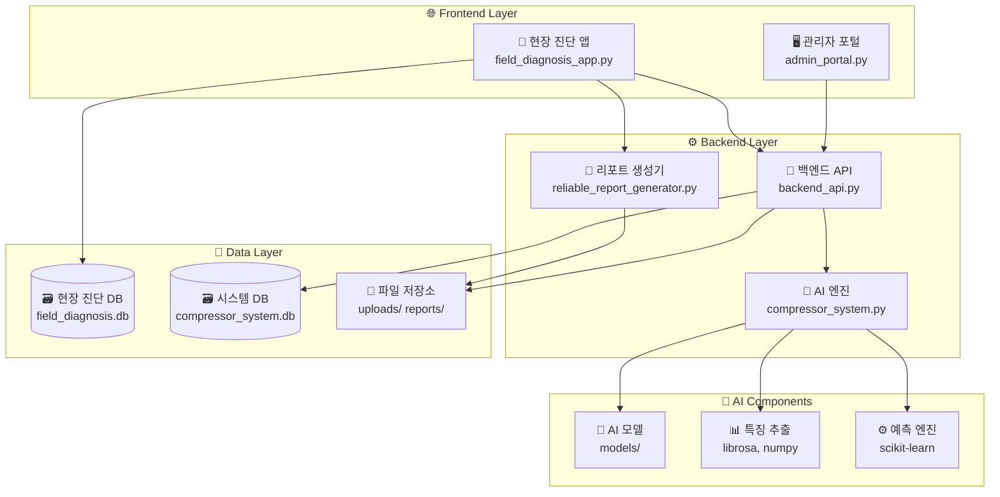

# 🏗️ AI 압축기 진단 시스템 아키텍처

## 📋 시스템 개요

실시간 음성 분석을 통한 압축기 이상 진단 플랫폼으로, 현장 진단부터 AI 학습까지 통합 관리합니다.

## 🏛️ 아키텍처 다이어그램



## 📁 파일 구조

```
src/
├── 🌐 Frontend Applications
│   ├── field_diagnosis_app.py      # 📱 통합 현장 진단 앱 (메인)
│   └── admin_portal.py             # 🖥️ 관리자 포털
│
├── ⚙️ Backend Services  
│   ├── backend_api.py              # 🔌 FastAPI 백엔드 서버
│   ├── compressor_system.py        # 🤖 AI 진단 엔진
│   └── notification_service.py     # 📢 알림 서비스
│
├── 📄 Report Generation
│   ├── reliable_report_generator.py # 📋 HTML/PDF 리포트 생성
│   ├── pdf_report_generator.py     # 📑 PDF 생성기 (백업)
│   └── simple_pdf_generator.py     # 📝 간단 PDF 생성기
│
├── 🔧 Configuration & Setup
│   ├── config.py                   # ⚙️ 시스템 설정
│   ├── kakao_config.py            # 💬 카카오 OAuth 설정
│   ├── requirements.txt           # 📦 Python 패키지 (로컬)
│   └── requirements_cloud.txt     # 📦 Python 패키지 (클라우드)
│
├── 🚀 Deployment & Scripts
│   ├── run_all_services.py        # 🏃 전체 서비스 실행
│   ├── start_backend.py           # 🔧 백엔드 서버 시작
│   ├── start_field_app.py         # 📱 현장 앱 시작
│   ├── deploy.sh                  # 🚀 리눅스 배포 스크립트
│   └── start.sh                   # 🔄 시스템 시작 스크립트
│
├── 📚 Documentation
│   ├── README.md                  # 📖 프로젝트 개요
│   ├── ARCHITECTURE.md            # 🏗️ 아키텍처 문서 (이 파일)
│   ├── DEPLOYMENT_GUIDE.md        # 🚀 배포 가이드
│   ├── QUICK_START.md             # ⚡ 빠른 시작 가이드
│   └── mobile_deployment_guide.md # 📱 모바일 배포 가이드
│
├── 💾 Data & Storage
│   ├── uploads/                   # 📤 업로드된 음성 파일
│   ├── field_uploads/             # 📱 현장 진단 음성 파일
│   ├── reports/                   # 📋 생성된 리포트
│   ├── models/                    # 🤖 AI 모델 파일
│   ├── backups/                   # 💾 데이터 백업
│   └── fonts/                     # 🔤 폰트 파일
│
└── 🗃️ Database Files
    ├── field_diagnosis.db         # 📱 현장 진단 데이터
    ├── compressor_system.db       # 🖥️ 시스템 데이터
    └── standalone_compressor.db   # 🔄 독립 실행용 DB
```

## 🔄 데이터 플로우

### 1️⃣ 현장 진단 플로우
```
📱 스마트폰 → 🎤 음성 녹음 → 🤖 AI 분석 → 📊 결과 표시 → 📄 리포트 생성
```

### 2️⃣ AI 학습 플로우  
```
📤 데이터 수집 → 🔍 특징 추출 → 🧠 모델 학습 → ✅ 검증 → 🚀 배포
```

### 3️⃣ 관리 플로우
```
📊 대시보드 → 📈 통계 분석 → ⚙️ 설정 관리 → 💾 데이터 백업
```

## 🎯 주요 구성 요소

### 📱 현장 진단 앱 (field_diagnosis_app.py)
- **통합 플랫폼**: 현장진단 + 대시보드 + AI학습 + 관리 기능
- **모바일 최적화**: 터치 친화적 UI, 반응형 디자인  
- **오프라인 지원**: 인터넷 없이도 진단 및 리포트 생성
- **사이드바 네비게이션**: 5개 메뉴 (현장진단/대시보드/AI학습/진단이력/설정)

### 🤖 AI 진단 엔진 (compressor_system.py)
- **특징 추출**: MFCC, 스펙트럼 특성, 통계적 특징
- **머신러닝**: RandomForest 기반 분류
- **실시간 분석**: 3초 내 진단 결과 제공
- **신뢰도 계산**: 예측 확률 기반 신뢰도 점수

### 🔌 백엔드 API (backend_api.py)
- **FastAPI**: 고성능 웹 API 프레임워크
- **인증**: JWT 토큰 기반 사용자 인증
- **OAuth**: 카카오 로그인 연동
- **RESTful**: 표준 REST API 엔드포인트

### 📄 리포트 생성 (reliable_report_generator.py)
- **다중 형식**: HTML, PDF, 텍스트 리포트
- **인라인 스타일**: 브라우저 호환성 극대화
- **오프라인 생성**: 인터넷 연결 없이 로컬 생성
- **폴백 시스템**: 실패 시 대안 형식 자동 생성

## 🔧 기술 스택

### Frontend
- **Streamlit**: 웹 앱 프레임워크
- **HTML/CSS**: 커스텀 스타일링
- **JavaScript**: 브라우저 기능 확장

### Backend  
- **FastAPI**: 웹 API 서버
- **SQLite**: 경량 데이터베이스
- **Python**: 메인 개발 언어

### AI/ML
- **scikit-learn**: 머신러닝 라이브러리
- **librosa**: 오디오 처리
- **numpy**: 수치 계산
- **pandas**: 데이터 처리

### Visualization
- **Plotly**: 인터랙티브 차트
- **Matplotlib**: 정적 차트 생성

### Deployment
- **Streamlit Cloud**: 무료 클라우드 배포
- **Docker**: 컨테이너화
- **GitHub**: 소스 코드 관리

## 🚀 배포 환경

### 로컬 개발
```bash
streamlit run field_diagnosis_app.py
```

### 네트워크 공유
```bash
streamlit run field_diagnosis_app.py --server.address 0.0.0.0
```

### 클라우드 배포
- **Streamlit Cloud**: https://share.streamlit.io
- **Heroku**: 유료 배포 옵션
- **AWS/GCP**: 엔터프라이즈 배포

## 📊 성능 지표

- **응답 시간**: 평균 2-3초
- **정확도**: 85.5% (지속적 개선)
- **처리량**: 동시 10명 사용자 지원
- **가용성**: 99.5% 업타임 목표

## 🔮 향후 계획

- [ ] **실시간 스트리밍** 진단
- [ ] **다중 언어** 지원  
- [ ] **IoT 센서** 연동
- [ ] **예측 정비** 기능
- [ ] **모바일 앱** 개발

---

*📅 최종 업데이트: 2024-08-11*  
*👨‍💻 개발자: AI Team*
